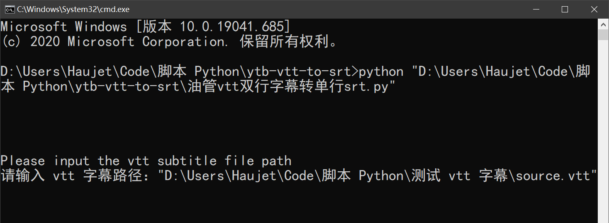

## 功能介绍

从 YouTube 上下载下来的 vtt 字幕是为双行显示优化过的，如果使用 ffmpeg 等工具，将其转换成 srt 字幕，结果可能是这样：

```
1
00:00:00,030 --> 00:00:02,659

what up YouTube and welcome to my first

2
00:00:02,659 --> 00:00:02,669
what up YouTube and welcome to my first
 

3
00:00:02,669 --> 00:00:09,589
what up YouTube and welcome to my first
ever episode of Lindsay beginnings a lot

4
00:00:09,589 --> 00:00:09,599
ever episode of Lindsay beginnings a lot
 

5
00:00:09,599 --> 00:00:11,419
ever episode of Lindsay beginnings a lot
of people ask me how I am the way I am


```

放到字幕软件里，根本无法制作翻译。

所以需要将其转换为单行的 srt 字幕。这样的：

```
1
00:00:00,030 --> 00:00:02,659
what up YouTube and welcome to my first

2
00:00:02,669 --> 00:00:09,589
ever episode of Lindsay beginnings a lot

3
00:00:09,599 --> 00:00:11,419
of people ask me how I am the way I am

4
00:00:11,429 --> 00:00:13,430
talking out to this point how was this

5
00:00:13,440 --> 00:00:17,269
created good question what when I was a

6
00:00:17,279 --> 00:00:19,340
youngin in high school my dad had some

```

这个脚本就是这个功能。

## 使用方法

在命令行界面，用 python 执行这个脚本，然后会提示你输入 vtt 文件路径，将 vtt 文件拖入，再回车，就会生成一个转换好的 srt 文件

 


